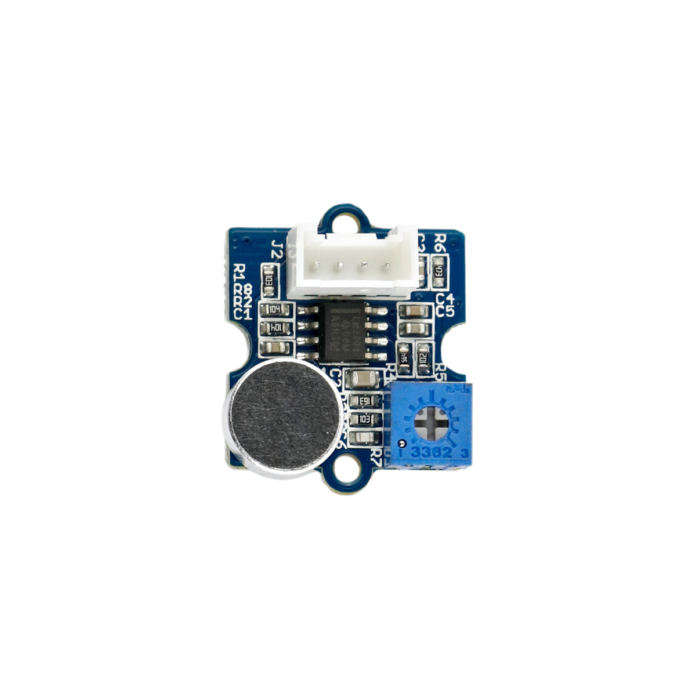

---
title: "Lautstärkesensor"
date: "2018-10-01T13:57:42.000Z"
tags: 
  - "sensor"
coverImage: "36_lautstaerkesensor.jpg"
material_number: "36"
material_type: "sensor"
material_short_descr: "Seeed Studio Grove – Loudness Sensor"
manufacture: "Seeed Studio"
manufacture_url: "https://www.seeedstudio.com/"
repo_name: "mks-SeeedStudio-Grove_Loudness_Sensor"
repo_prefix: "mks"
repo_manufacture: "SeeedStudio"
repo_part: "Grove_Loudness_Sensor"
product_url: "https://wiki.seeedstudio.com/Grove-Loudness_Sensor/"
clone_url: "https://github.com/Make-Your-School/mks-SeeedStudio-Grove_Loudness_Sensor.git"
embedded_example_file: "examples/Grove_Loudness_Sensor_minimal/Grove_Loudness_Sensor_minimal.ino"
---

# Lautstärkesensor

## Beschreibung
Der Lautstärkesensor erfasst die Umgebungsgeräusche und misst hieraus die Lautstärke in Form des sogenannten Schalldrucks. Dieser verarbeitet die erfassten Umgebungsgeräusche und gibt ein analoges Signal direkt proportional zur Lautstärke aus. Mit dem integrierten Potentiometer kann die Sensitivität eingestellt werden. Der Sensor wird direkt oder mithilfe des Grove Shields an einen Arduino über einen \[simple\_tooltip content='Digital vs. Analog:

- Analoge Signale können beliebige, kontinuierliche Werte annehmen. Sie verändern sich stufenlos. Dadurch können theoretisch unendlich kleine Änderungen (und damit ein unendlicher Informationsinhalt) übertragen werden. Einschränkend wirkt die Genauigkeit, mit der das analoge Signal ausgelesen/erfasst wird.
- Das digitale Signal nimmt nur diskrete Werte an und springt bei einer etwaigen Änderung von einem Wert zum nächsten. Es kann nur eine definierte Anzahl an Informationsinhalten übertragen werden. Vorteilhaft ist dagegen die damit verbundene Fehlerfreiheit bei minimalsten, ungewollten Schwankungen. Oftmals werden nur zwei Werte HIGH und LOW (Ein/Aus oder 1/0) übermittelt.

'\]analogen\[/simple\_tooltip\] \[simple\_tooltip content='Die Mikrocontroller besitzen kleine metallische Kontakte, an die Komponenten, Shields oder andere Platinen angeschlossen werden können. Diese Kontakte werden Pins genannt und können oft als sogenannte GPIO’s (Allzweck Ein- und Ausgabe) eingesetzt werden. Dies bedeutet, dass diese Pins direkt über die Programmierung des Mikrocontrollers angesprochen werden können und hierbei sogar bestimmt werden kann, ob dieser Pin ein Eingang (beispielsweise zum Auslesen eines Sensors) oder als Ausgang (beispielsweise zur Steuerung eines Motors) genutzt werden kann. Praktisches vereinfachtes Beispiel: Wird am Arduino eine LED an Pin 1 angeschlossen, kann im Programm direkt der Pin 1 als „An“ oder „Aus“ definiert werden und damit die LED an- oder ausgeschaltet werden. '\]Pin \[/simple\_tooltip\]angeschlossen.

Das Modul wird beispielsweise in einer Messstation für Umweltdaten, wie Feinstaub, Lautstärke und UV-Strahlung eingesetzt.

Alle weiteren Hintergrundinformationen, sowie ein Beispielaufbau und alle notwendigen Programmbibliotheken sind auf dem offiziellen Wiki (bisher nur in englischer Sprache) von Seeed Studio zusammengefasst. Zusätzlich findet man über alle gängigen Suchmaschinen durch die Eingabe der genauen Komponentenbezeichnungen entsprechende Projektbeispiele und Tutorials.

Die genaue Bezeichnung des Sensors, die bei der Suche von Beschreibungen und Anleitungen wichtig sein kann, lautet LM2904.

<!-- infolist -->

<!-- infolists -->
<iframe title="YouTube video player" src="https://www.youtube.com/embed/A4VYpebn1BQ" width="560" height="315" frameborder="0" allowfullscreen="allowfullscreen"></iframe>

 

## Wichtige Links für die ersten Schritte:

- [Seeed Studio Wiki](http://wiki.seeedstudio.com/Grove-Loudness_Sensor/) [- Lautstärkesensor](http://wiki.seeedstudio.com/Grove-Loudness_Sensor/)

## Projektbeispiele:

- [Hackster - Umweltdaten-Messstation](https://www.hackster.io/taifur/solar-powered-environmental-monitoring-kit-b1d03d)

## Weiterführende Hintergrundinformationen:

- [Schalldruck - Wikipedia Artikel](https://de.wikipedia.org/wiki/Schalldruck)
- [GPIO - Wikipedia Artikel](https://de.wikipedia.org/wiki/Allzweckeingabe/-ausgabe)
- [Potentiometer - Wikipedia Artikel](https://de.wikipedia.org/wiki/Potentiometer)
- [GitHub-Repository: Lautstärkesensor](https://github.com/MakeYourSchool/36-Lautstaerkesensor)

