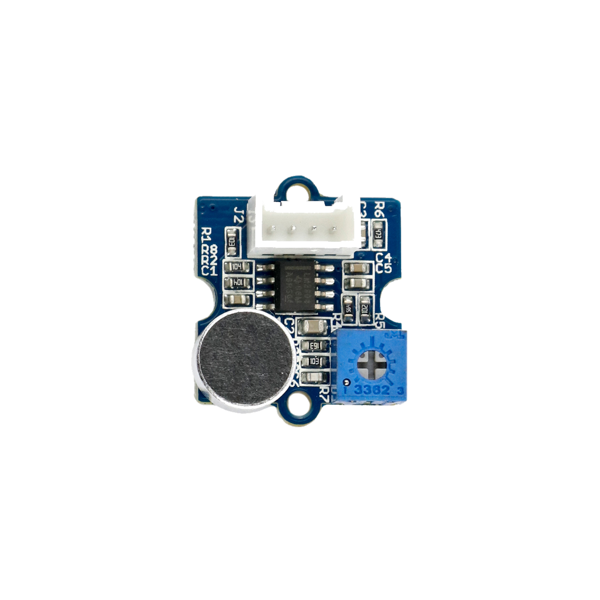

# Lautstärkesensor



## Beschreibung
Der Lautstärkesensor erfasst die Umgebungsgeräusche und misst hieraus die Lautstärke in Form des sogenannten Schalldrucks. Dieser verarbeitet die erfassten Umgebungsgeräusche und gibt ein analoges Signal direkt proportional zur Lautstärke aus. Mit dem integrierten Potentiometer kann die Sensitivität eingestellt werden. Der Sensor wird direkt oder mithilfe des Grove Shields an einen Arduino über einen analogen Pinangeschlossen.

Das Modul wird beispielsweise in einer Messstation für Umweltdaten, wie Feinstaub, Lautstärke und UV-Strahlung eingesetzt.

Alle weiteren Hintergrundinformationen, sowie ein Beispielaufbau und alle notwendigen Programmbibliotheken sind auf dem offiziellen Wiki (bisher nur in englischer Sprache) von Seeed Studio zusammengefasst. Zusätzlich findet man über alle gängigen Suchmaschinen durch die Eingabe der genauen Komponentenbezeichnungen entsprechende Projektbeispiele und Tutorials.

Die genaue Bezeichnung des Sensors, die bei der Suche von Beschreibungen und Anleitungen wichtig sein kann, lautet LM2904.


## Beispiel

schau dir das Minimal-Beispiel an:

```c++:public/mks/parts/mks-SeeedStudio-Grove_Loudness_Sensor/examples/Grove_Loudness_Sensor_minimal/Grove_Loudness_Sensor_minimal.ino
// look in the linked file.
```

<!-- infolist -->

<iframe title="YouTube video player" src="https://www.youtube.com/embed/A4VYpebn1BQ" width="560" height="315" frameborder="0" allowfullscreen="allowfullscreen"></iframe>

 

## Wichtige Links für die ersten Schritte:

- [Seeed Studio Wiki](http://wiki.seeedstudio.com/Grove-Loudness_Sensor/) [- Lautstärkesensor](http://wiki.seeedstudio.com/Grove-Loudness_Sensor/)

## Projektbeispiele:

- [Hackster - Umweltdaten-Messstation](https://www.hackster.io/taifur/solar-powered-environmental-monitoring-kit-b1d03d)

## Weiterführende Hintergrundinformationen:

- [Schalldruck - Wikipedia Artikel](https://de.wikipedia.org/wiki/Schalldruck)
- [GPIO - Wikipedia Artikel](https://de.wikipedia.org/wiki/Allzweckeingabe/-ausgabe)
- [Potentiometer - Wikipedia Artikel](https://de.wikipedia.org/wiki/Potentiometer)
- [GitHub-Repository: Lautstärkesensor](https://github.com/MakeYourSchool/36-Lautstaerkesensor)


